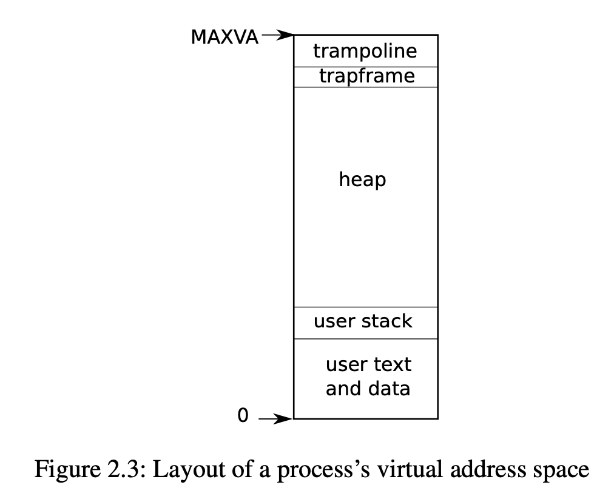

# Chapter 2：Operating system organization

1. OS要满足的三个条件：multiplexing, isolation, and interaction.
2. xv6运行在multicore的RISC-V multiprocessor上。
3. RISC-V is a 64-bit CPU, and xv6 is written in “LP64” C, which means long (L) and pointers (P) in the C programming language are 64 bits, but int is 32-bit

## 2.1 Abstracting physical resources

1. RISC-V处理指令有三种模式：machine mode, supervisor mode, and user mode.
    - **machine mode**: 完整权限，通常用于配置computer。CPU启动时处于machine mode。xv6仅在machine code处理少量代码，之后就转向supervisor mode。
    - **supervisor mode**: 能被允许执行privileged instructions，比如enable/disable interrupts, read/write the register that holds the address of a page table
    - **user mode**: 不能执行privileged instructions。若要执行privileged instructions，则切换到supervisor mode
2. user space & kernel space
    - **user space**: app execute user-mode instructions
    - **kernel space**: in supervisor mode execute privileged instructions
3. **kernel**: the software running in kernel space

## 2.3 Kernel organization

1. Key Question: os中的哪些部分应该运行在supervisor mode 中？
2. **monolithic kernel**：the entire operating system resides in the kernel, so that the implementations of all system calls run in supervisor mode. (Many Unix kernels, e.g. Linux)
3. **microkernel**: minimize the amount of os code in supervisor code,  place the bulk of os code in user mode (L4, Minix and QNX, widely used in embedded settings)
4. xv6是monolithic kernel

## 2.5 Process overview

1. xv6通过process来实现isolation

2. process:
	- 防止一个process侵占或监视其他process的memory、CPU、fd等
	- 防止process侵入kernel
	- 让program认为只有他自己一台机器，通过address space实现
	
3. xv6的每个process都有一个独立的page table，用来定义该process的address space

4. 

   顺序:instruction->global variables->stack->heap->trapframe->trampoline

5. There are a number of factors that limit **the maximum size of a process’s address space**: pointers on the RISC-V are 64 bits wide; the hardware only uses the low 39 bits when looking up virtual addresses in page tables; and xv6 only uses 38 of those 39 bits. Thus, the maximum address is 238 − 1 = 0x3fffffffff, which is MAXVA 

6. trampoline和trapframe在chapter4中会介绍

7. Kernel state在**struct proc(kernel/proc.h:86)**中。一个kernel state最重要的部分是他的page table、kernel stack和run state

8. To switch transparently between processes, the kernel suspends the currently running thread and resumes another process’s thread.

9. Much of state of a thread (e.g. loacl variables, function call return addresses) is stored on the thread's stack.

10. 每个process都有两个stacks：user stack & kernel stack (p->kstack).

    - 当user执行user instructions，只有他的user stack正在被使用，他的kernel stack是empty的。
    - 当process由于system call or interrupt进入kernel，那么kernel code就在kernel stack中执行
    - 当一个process在kernel中，他的user stack仍然保留原来的数据，但并没有被使用
    - a process's thread 交替使用他的user stack和kernel stack
    - kernel stack是独立的（并且和user code分离），所以kernel仍然能执行即便process的user stack崩溃了

11. system call的实现原理：
    - process能通过执行RISC-V的**ecall指令**来生成一个system call。
    - 该指令raise the hardware privilege level并且将程序计数器program counter指向ker-defined entry point。在entry point的code转向kernel stack然后执行kernel instructions来完成system call。
    - 当system call完成后后，kernel转回到user stack然后通过**sret指令**回到user space。该指令lower the hardware privilege level并接着运行system call之后的user instructions
12. p->state显示process的状态是以下五种状态之一：
    - allocated
    - ready to run
    - running
    - waiting for I/O
    - exiting

## 2.6 Code: starting xv6 and the first process

**xv6内核如何启动并且如何开始第一个process**

1. 开启电源，xv6启动read-only memory中的boot loader, which loads xv6 kernel  into memory
2. 在machine mode下, CPU 从**_entry ** (kernel/entry.S:6) 处开始执行xv6。RISC-V启动时，paging hardware失效, virtual addresses直接映射到physical address.
3. Loader loads the xv6 kernel into memory at physical address 0x80000000。之所以是0x80000000而不是0x0，是因为0x0: 0x80000000包含了I/O devices
4. **_entry**上的指令设置了堆栈，以便xv6可以运行C代码。 Xv6在文件start.c (kernel / start.c: 11) 中为initial stack (stack0)声明空间。 *_entry*处的代码将stack pointer register **sp**加载到stack顶部的地址stack0 + 4096。之所以是顶部，是因为RISC-V上的stack是向下增长的。现在，kernel有了stack，_entry在启动时就能在*stack* (kernel/start.c: 21)处调用C代码。
5. **start**函数执行一些仅允许在machine mode下执行的配置configuration，然后切换到supervisor mode。
6. 要进入supervisor模式，RISC-V提供了指令**mret**。This instruction is most often used to return from a previous call from supervisor mode to machine mode. start isn’t returning from such a call, and instead sets things up as if there had been one: it sets the previous privilege mode to supervisor in the register mstatus, it sets the return address to main by writing main’s address into the register mepc, disables virtual address translation in supervisor mode by writing 0 into the page-table register satp, and delegates all interrupts and exceptions to supervisor mode.
7. 在进入超级用户模式之前，start需要执行另一项任务：它对clock chip进行编程以生成timer interrupts。之后，start通过调用mret可以开始return to supervisor mode。这将导致程序计数器更改为main（kernel / main.c：11）。
8. 在main（kernel / main.c：11）初始化多个设备和子系统后，它将通过调用userinit（kernel / proc.c：212）创建第一个process。第一个进程执行一个用RISC-V assembly语言写的的small program **initcode.S**（user / initcode.S：1），该程序通过调用exec系统调用来重新进入内核。正如我们在第一章中所看到的，exec用一个新的program（在本例中为*/init*）替换了当前process的内存和寄存器。内核完成exec后，它将在*/init*进程中返回到user space。如果需要，Init（user / init.c：15）会创建一个新的控制台设备文件console device file，然后将其作为file descriptors 0、1和2打开。然后，它将在console上启动Shell。系统启动。

## 2.7 Reak World

xv6中的进程不支持多线程。Supporting multiple threads in a process involves quite a bit of machinery that xv6 doesn’t have, including potential interface changes (e.g., Linux’s clone, a variant of fork), 

